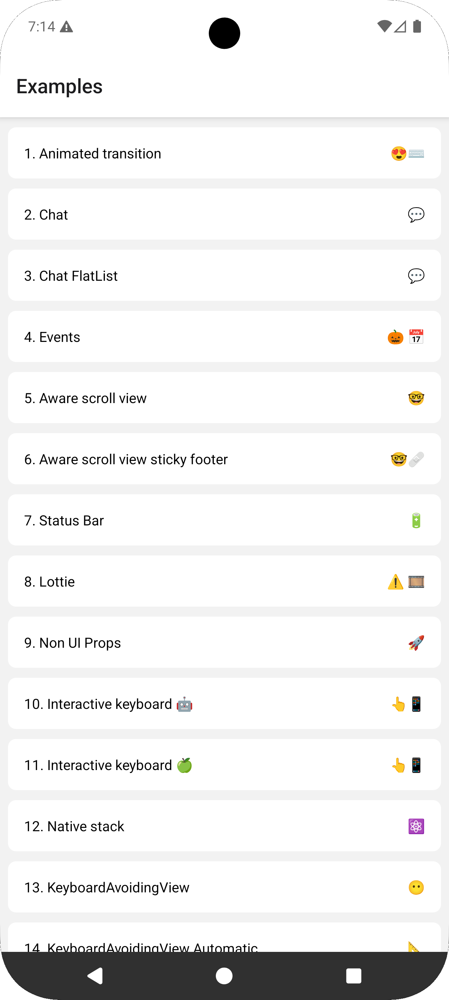

# FabricExample

This example app runs on the [New Architecture](https://reactnative.dev/docs/the-new-architecture/landing-page) (Fabric).

## Run the app



1. Install the repository dependencies (from the project root):

```bash
yarn
```

2. Install the FabricExample app dependencies:

```bash
cd FabricExample
yarn
```

3. Start the Metro server:

```bash
yarn start
```

4. In a separate terminal, build and install the app:

```bash
yarn android
# or
yarn ios
```

## Contributing

If you discovered a bug and know the fix or would like to make a contribution to the project, please check the [contribution guide](../CONTRIBUTING.md).
