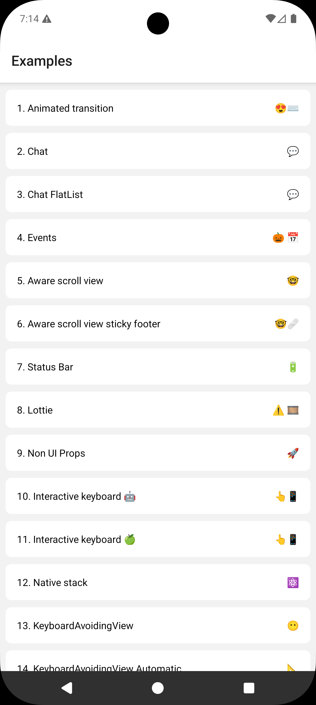

# Example

```bash
# first install dependencies of the repository
# at the parent folder
yarn 

# second run yarn of the example app   
cd example
yarn

# then start the metro server
yarn start

# in parallel, install the app
yarn android
# or
yarn ios
```
