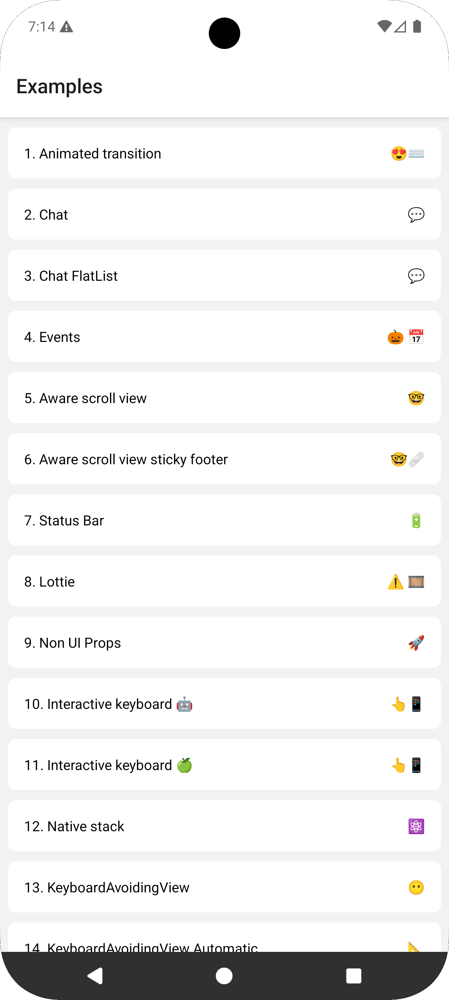

# Example

## Run the app



1. Install the repository dependencies (from the project root):

```bash
yarn
```

2. Install the example app dependencies:

```bash
cd example
yarn
```

3. For iOS, install the dependencies (Ruby 3.3.0 is selected automatically by
   rbenv and other version managers that honor `.ruby-version`):

```bash
bundle install
cd ios
bundle exec pod install
cd ..
```

4. Start the Metro server:

```bash
yarn start
```

5. In a separate terminal, build and install the app:

```bash
yarn android
# or
yarn ios
```

## Contributing

If you discovered a bug and know the fix or would like to make a contribution to the project, please check the [contribution guide](../CONTRIBUTING.md).
